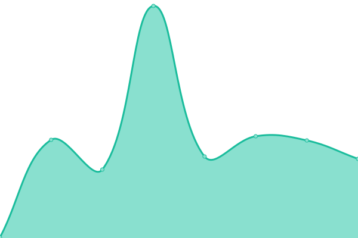

# [📈 Live Status](https://status.ymoz.com): <!--live status--> **🟩 All systems operational**

This repository contains the open-source uptime monitor and status page for [Upptime](https://upptime.js.org), powered by [Upptime](https://github.com/upptime/upptime).

With [Upptime](https://upptime.js.org), you can get your own unlimited and free uptime monitor and status page, powered entirely by a GitHub repository. We use [Issues](https://github.com/upptime/upptime/issues) as incident reports, [Actions](https://github.com/Downly-Net/YMOZ/actions) as uptime monitors, and [Pages](https://status.ymoz.com) for the status page.

<!--start: status pages-->
<!-- This summary is generated by Upptime (https://github.com/upptime/upptime) -->
<!-- Do not edit this manually, your changes will be overwritten -->
<!-- prettier-ignore -->
| URL | Status | History | Response Time | Uptime |
| --- | ------ | ------- | ------------- | ------ |
|  [Main site](https://ymoz.com) | 🟩 Up | [main-site.yml](https://github.com/Downly-Net/YMOZ/commits/HEAD/history/main-site.yml) | 

 797ms
     
 | 

<a href="https://status.ymoz.com/history/main-site">100.00%</a>
    

|  IMAP | 🟩 Up | [imap.yml](https://github.com/Downly-Net/YMOZ/commits/HEAD/history/imap.yml) | 

 601ms
     
 | 

<a href="https://status.ymoz.com/history/imap">100.00%</a>
    

|  POP | 🟩 Up | [pop.yml](https://github.com/Downly-Net/YMOZ/commits/HEAD/history/pop.yml) | 

 198ms
     
 | 

<a href="https://status.ymoz.com/history/pop">100.00%</a>
    

|  [SOGo](https://mail.ymoz.com/SOGo) | 🟩 Up | [so-go.yml](https://github.com/Downly-Net/YMOZ/commits/HEAD/history/so-go.yml) | 

 269ms
     
 | 

<a href="https://status.ymoz.com/history/so-go">100.00%</a>
    

|  Email admin | 🟩 Up | [email-admin.yml](https://github.com/Downly-Net/YMOZ/commits/HEAD/history/email-admin.yml) | 

 185ms
     
 | 

<a href="https://status.ymoz.com/history/email-admin">100.00%</a>
    

|  CalDav | 🟩 Up | [cal-dav.yml](https://github.com/Downly-Net/YMOZ/commits/HEAD/history/cal-dav.yml) | 

 132ms
     
 | 

<a href="https://status.ymoz.com/history/cal-dav">100.00%</a>
    

|  CardDav | 🟩 Up | [card-dav.yml](https://github.com/Downly-Net/YMOZ/commits/HEAD/history/card-dav.yml) | 

 133ms
     
 | 

<a href="https://status.ymoz.com/history/card-dav">100.00%</a>
    

<!--end: status pages-->

[**Visit our status website →**](https://status.ymoz.com)

## 📄 License

- Powered by: [Upptime](https://github.com/upptime/upptime)
- Code: [MIT](./LICENSE) © [Upptime](https://upptime.js.org)
- Data in the `./history` directory: [Open Database License](https://opendatacommons.org/licenses/odbl/1-0/)
